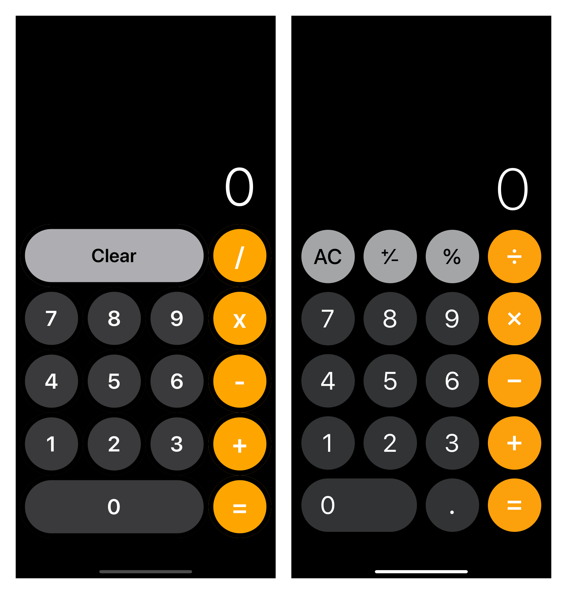

# CalculatorClone

**100% programmatic UI.** 0% Storyboard. Fits on all device sizes.

Recreation of Apple's iOS 13 stock calculator app. I know that this clone doesn't have decimals, negatives, and percentage capabilities but arithmetic is not the point of this project :)

Programmatic UI has many advantages and is commonly used on larger applications.

**Benefits**
- Reusability: Re-use code where similar layout is called for throughout the app.
- Ease of control: If you want to change something(like a font color or size) on a repeated element, you can change one line of code instead of manually adjusting 10 different labels in interface builder.
- Eliminate storyboard mess: The larger an app gets, the more confusing and harder it is to follow the flow of the storyboards. 
- Collaboration: Storyboards are just XML files. When multiple people are editing storyboards, it causes many merge conflicts that are a pain to resolve. 

**Drawbacks:**
-	No visual representation of different views.
-	View controllers get larger from added code.
  
  
### My clone vs Apple's stock calculator(on iPhone 11)

I hope this app helps inspire you to learn and get comfortable with programmatic UI!
